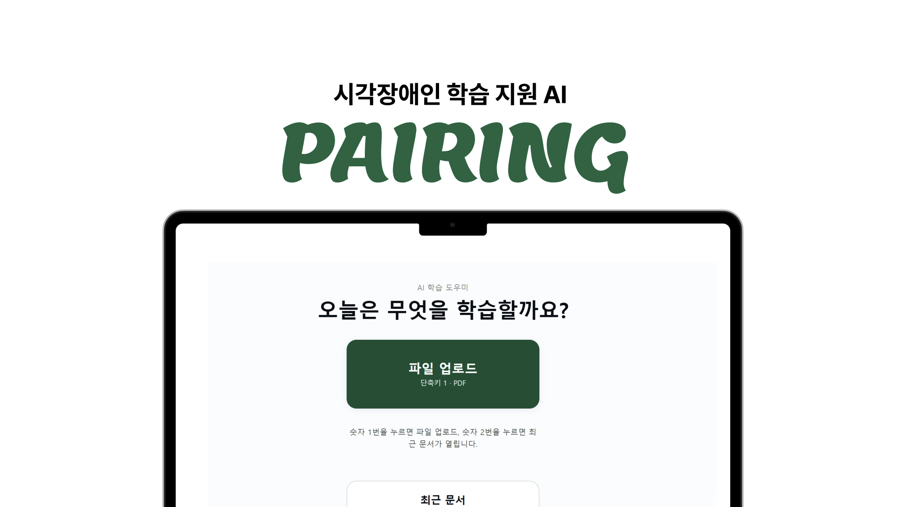

# Pairing 🔊

> 시각장애 대학생을 위한 음성 기반 문서 AI 서비스
> 2026 Low-code AI Startup Hackathon with Upstage 우수상 🏆

## 서비스 소개
PDF 강의자료를 업로드하면 AI가 문서 구조를 분석해 핵심 내용을 음성으로 설명해주는 접근성 서비스입니다.

## 기술 스택
| 역할 | 기술 |
|------|------|
| 프론트엔드 | Lovable |
| 워크플로우 | n8n Cloud |
| 문서 파싱 | Upstage Document Parse |
| AI 생성 | Upstage Solar LLM |
| TTS | Web Speech API |

## 시스템 아키텍처
Lovable (PDF 업로드)
  → n8n 파이프라인
    → Upstage Document Parse (구조 복원)
    → Solar LLM (구어체 설명 생성)
  → Lovable (화면 표시 + 음성 재생)

## n8n 워크플로우 구성 (8노드)
Webhook → Edit Fields → Convert to File
→ Document Parse → Prompt Builder
→ Solar LLM → Response Builder
→ Respond to Webhook

## 주요 기능
- 요약 모드: 핵심 키워드, 표 설명, 일정 자동 추출
- 전체읽기 모드: 본문 구어체 변환
- 질의응답 모드: 문서 기반 Q&A

## 서비스 링크
- Lovable 배포 URL: https://audio-smart-study.lovable.app
- n8n 워크플로우: Pairing_workflow.json 참고

## Contributors
- n8n 워크플로우: 정아현
- Lovable(프론트엔드): 김아현
